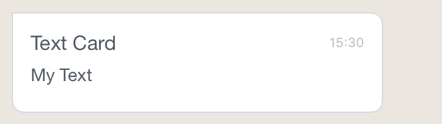
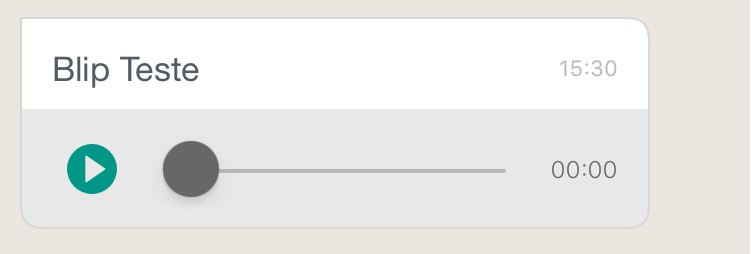
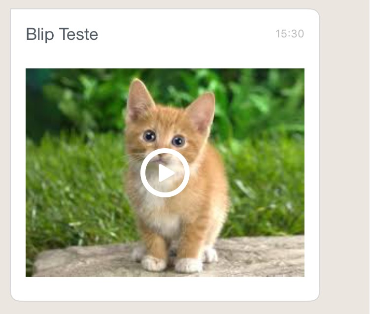
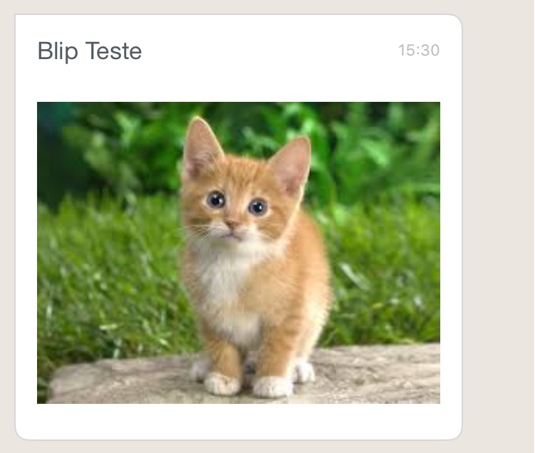
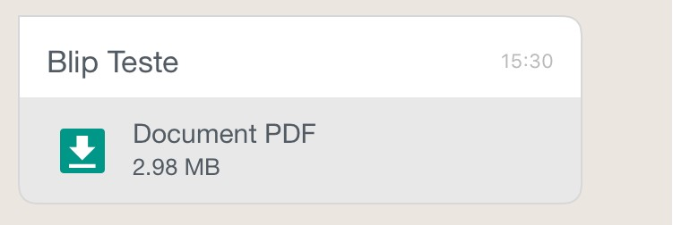
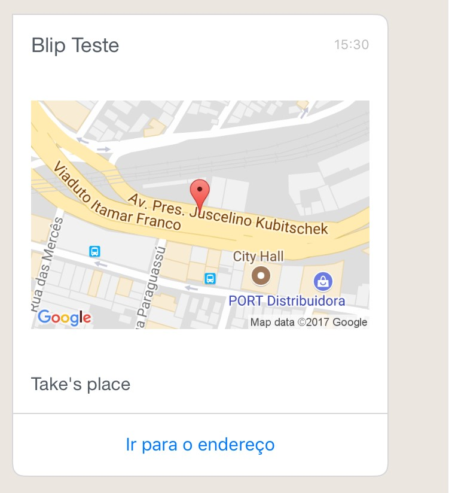
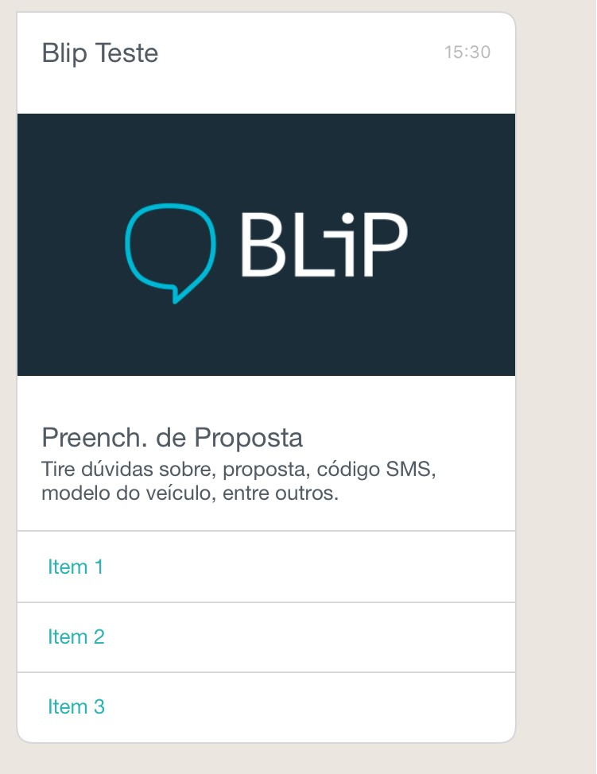
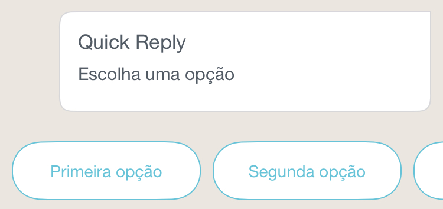
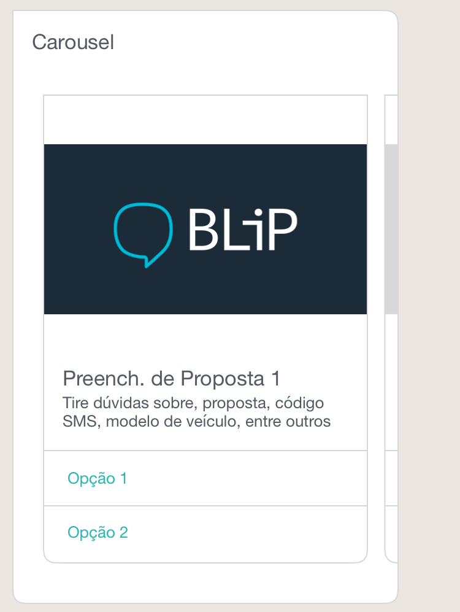

# Blip Cards for iOS

SDK to easily add BLiP Cards on your iOS app.

## Installation
----------------
### Prerequisites
To use the BLiP Cards for iOS, you must target iOS 8 or later.

Import the BLiP Cards for iOS into your project via CocoaPods:

1. If you have not installed CocoaPods, install it by running the command:

		$ [sudo] gem install cocoapods
		$ pod setup

2. Create a plain text file named `Podfile` (without any file extension) inside your project directory. Add the lines below to your file and replace `YourTarget` with your actual target name.

		target 'YourTarget' do
		  use_frameworks!
		  pod "BlipCards"
		end

3. Run the following command.

		$ pod install

4. Open up `*.xcworkspace` with Xcode and start using the project.

	**Note**: Do **NOT** use `*.xcodeproj`.  If yout do, you get an error for not being able to get your pod projects.

## Quick start
All message types are based on a JSON to configure the card. Check the [Lime Protocol](http://limeprotocol.org/content-types.html) content types for more details.

To create a card of any type you need to have a *UIView* ready to display it.
Once this is done, you can use the class `BlipCards` to return a builder for the card.

Using the `BlipCard` object, you have to specify the side where the card shoud be displayed using the methods `left`, `right` and `withoutSide` passing the conteiner view.
Eg:
```obj-c
Builder *b = [[[BlipCard alloc] init] left: myConteiner]
```
Once the `Builder` object is set, now you have to set the message document with ``setDocument: myDictionary``.

After that there are some customizations that can be done before building your card, like add a sender name with ``setChatName:@"Sender"]`` or define a the delegate for selection on a Menu with `` builder.menuDelegate = self;``.

Putting everything together the basic to build a card is:
```obj-c
Builder *b = [[[[BlipCard alloc] init] left:_content] setDocument:json];
UIView *v = [b build];
```

## Examples

### ChatState
Adding a chat state:

**Objective-C**
```obj-c
NSString *message = @"{\"to\":\"104222@telegram.gw.msging.net\",\"type\":\"application/vnd.lime.chatstate+json\",\"content\": {\"state\": \"composing\"}}";

// Get a NSDictionary from the JSON
NSError *jsonError;
NSData *objectData = [message dataUsingEncoding:NSUTF8StringEncoding];
NSDictionary *json = [NSJSONSerialization JSONObjectWithData:objectData
			options:NSJSONReadingMutableContainers													error:&jsonError];

// Build the card from the NSDictionary
Builder *b = [[[[BlipCard alloc] init] left:_content] setDocument:json];

// Add item to view
[self addItem: [b build]];
```
The result is this:


### Text Card
Adding a received text card, with the sender's name and the time of the message:

**Objective-C**
```obj-c
NSString *message = @"{\"id\":\"1\",\"to\":\"128271320123982@messenger.gw.msging.net\",\"type\":\"text/plain\",\"content\":\"My Text\"}";

// Get a NSDictionary from the JSON
NSError *jsonError;
NSData *objectData = [message dataUsingEncoding:NSUTF8StringEncoding];
NSDictionary *json = [NSJSONSerialization JSONObjectWithData:objectData
                        options:NSJSONReadingMutableContainers
                        error:&jsonError];

// Build the card from the NSDictionary
Builder *b = [[[[[[BlipCard alloc] init] left:_content] setChatName:@"Text Card"] setChatDateTime:@"15:30"] setDocument:json];

// Add item to view
[self addItem: [b build]];
```
The result is this:



### Media Card (Audio)
Adding a received audio card, with the sender's name and the time of the message:

**Objective-C**
```obj-c
 NSString *message = @"{\"id\": \"2\",\"to\": \"553199991111@0mn.io\",\"type\": \"application/vnd.lime.media-link+json\",\"content\": {\"type\": \"audio/mp3\",\"uri\": \"http://blaamandagjazzband.dk/jazz/mp3/basin_street_blues.mp3\",\"size\": 3124123}}";

// Get a NSDictionary from the JSON
NSError *jsonError;
NSData *objectData = [message dataUsingEncoding:NSUTF8StringEncoding];
NSDictionary *json = [NSJSONSerialization JSONObjectWithData:objectData												options:NSJSONReadingMutableContainers													error:&jsonError];

// Build the card from the NSDictionary
Builder *b = [[[[[[BlipCard alloc] init]
					left:_content] setChatName:@"Blip Teste"] setChatDateTime:@"15:30"]
				setDocument:json];

// Add item to view
[self addItem: [b build]];
```
The result is this:



### Media Card (Video)
Adding a received video card, with the sender's name and the time of the message:

**Objective-C**
```obj-c
 NSString *message = @"{\"id\": \"2\",\"to\": \"553199991111@0mn.io\",\"type\": \"application/vnd.lime.media-link+json\",\"content\": {\"type\": \"video/mp4\",\"uri\": \"http://www.onirikal.com/videos/mp4/nestlegold.mp4\",\"size\": 3124123,\"previewUri\": \"https://encrypted-tbn3.gstatic.com/images?q=tbn:ANd9GcS8qkelB28RstsNxLi7gbrwCLsBVmobPjb5IrwKJSuqSnGX4IzX\",\"previewType\": \"image/jpeg\"}}";

// Get a NSDictionary from the JSON
NSError *jsonError;
NSData *objectData = [message dataUsingEncoding:NSUTF8StringEncoding];
NSDictionary *json = [NSJSONSerialization JSONObjectWithData:objectData												options:NSJSONReadingMutableContainers
			error:&jsonError];

// Build the card from the NSDictionary
Builder *b = [[[[[[BlipCard alloc] init]
					left:_content] setChatName:@"Blip Teste"] setChatDateTime:@"15:30"]
				setDocument:json];

// Add item to view
[self addItem: [b build]];
```
The result is this:



### Media Card (Image)
Adding a received image card, with the sender's name and the time of the message:

**Objective-C**
```obj-c
 NSString *message = @"{\"id\": \"1\",\"to\": \"553199991111@0mn.io\",\"type\": \"application/vnd.lime.media-link+json\",\"content\": {\"title\": \"Cat\",\"text\": \"Here is a cat image for you!\",\"type\": \"image/jpeg\",\"uri\": \"http://2.bp.blogspot.com/-pATX0YgNSFs/VP-82AQKcuI/AAAAAAAALSU/Vet9e7Qsjjw/s1600/Cat-hd-wallpapers.jpg\",\"aspectRatio\": \"1:1\",\"size\": 227791,\"previewUri\": \"https://encrypted-tbn3.gstatic.com/images?q=tbn:ANd9GcS8qkelB28RstsNxLi7gbrwCLsBVmobPjb5IrwKJSuqSnGX4IzX\",\"previewType\": \"image/jpeg\"}}";

// Get a NSDictionary from the JSON
NSError *jsonError;
NSData *objectData = [message dataUsingEncoding:NSUTF8StringEncoding];
NSDictionary *json = [NSJSONSerialization JSONObjectWithData:objectData
			options:NSJSONReadingMutableContainers
			error:&jsonError];

// Build the card from the NSDictionary
Builder *b = [[[[[[BlipCard alloc] init]
					left:_content] setChatName:@"Blip Teste"] setChatDateTime:@"15:30"]
				setDocument:json];

// Add item to view
[self addItem: [b build]];
```
The result is this:



### Media Card (Document)
Adding a received document card, with the sender's name and the time of the message:

**Objective-C**
```obj-c
 NSString *message = @"{\"id\": \"2\",\"to\": \"553199991111@0mn.io\",\"type\": \"application/vnd.lime.media-link+json\",\"content\": {\"type\": \"application/pdf\",\"uri\": \"https://s3-sa-east-1.amazonaws.com/i.imgtake.takenet.com.br/d6ztq/d6ztq.pdf\",\"size\": 3124123,\"text\": \"Document PDF\"}}";

// Get a NSDictionary from the JSON
NSError *jsonError;
NSData *objectData = [message dataUsingEncoding:NSUTF8StringEncoding];
NSDictionary *json = [NSJSONSerialization JSONObjectWithData:objectData
			options:NSJSONReadingMutableContainers
			error:&jsonError];

// Build the card from the NSDictionary
Builder *b = [[[[[[BlipCard alloc] init]
					left:_content] setChatName:@"Blip Teste"] setChatDateTime:@"15:30"]
				setDocument:json];

// Add item to view
[self addItem: [b build]];
```
The result is this:



### Location Card
Adding a received location card, with the sender's name and the time of the message:

**Objective-C**
```obj-c
 NSString *message = @"{\"id\": \"1\",\"to\": \"1042221589186385@messenger.gw.msging.net\",\"type\": \"application/vnd.lime.location+json\",\"content\": {\"latitude\": -19.918899,\"longitude\": -43.959275,\"altitude\": 853,\"text\": \"Take's place\"}}";

// Get a NSDictionary from the JSON
NSError *jsonError;
NSData *objectData = [message dataUsingEncoding:NSUTF8StringEncoding];
NSDictionary *json = [NSJSONSerialization JSONObjectWithData:objectData
			options:NSJSONReadingMutableContainers
			error:&jsonError];

// Build the card from the NSDictionary
Builder *b = [[[[[[BlipCard alloc] init]
					left:_content] setChatName:@"Blip Teste"] setChatDateTime:@"15:30"]
				setDocument:json];

// Add item to view
[self addItem: [b build]];
```
The result is this:



### Web Link Card
Adding a received weblink card, with the sender's name and the time of the message:

**Objective-C**
```obj-c
 NSString *message = @"{\"id\": \"1\",\"to\": \"553199991111@0mn.io\",\"type\": \"application/vnd.lime.web-link+json\",\"content\": {\"uri\": \"http://www.uol.com.br\",\"target\": \"self\",\"text\": \"Segue documentação do web-link\"}}";

// Get a NSDictionary from the JSON
NSError *jsonError;
NSData *objectData = [message dataUsingEncoding:NSUTF8StringEncoding];
NSDictionary *json = [NSJSONSerialization JSONObjectWithData:objectData
			options:NSJSONReadingMutableContainers
			error:&jsonError];

// Build the card from the NSDictionary
Builder *b = [[[[[[BlipCard alloc] init]
					left:_content] setChatName:@"Blip Teste"] setChatDateTime:@"15:30"]
				setDocument:json];

// Add item to view
[self addItem: [b build]];
```
The result is this:


### Multimedia Menu Card
Adding a received multimedia menu card, with the sender's name and the time of the message:

**Objective-C**
```obj-c
 NSString *message = @"{\"id\": \"1\",\"to\": \"1042221589186385@messenger.gw.msging.net\",\"type\": \"application/vnd.lime.document-select+json\",\"content\": {\"header\": {\"type\": \"application/vnd.lime.media-link+json\",\"value\": {\"title\": \"Preench. de Proposta\",\"text\": \"Tire dúvidas sobre, proposta, código SMS, modelo do veículo, entre outros. \",\"type\": \"image/jpeg\",\"uri\": \"http://files.lojas.club/blip.png\",\"aspectRatio\": \"1:1\"}},\"options\": [{\"label\": {\"type\": \"text/plain\",\"value\": \"Item 1\"},\"value\": {\"type\": \"application/json\",\"value\": {\"action\": \"show-items\"}}},{\"label\": {\"type\": \"text/plain\",\"value\": \"Item 2\"},\"value\": {\"type\": \"application/json\",\"value\": {\"action\": \"show-items\"}}},{\"label\": {\"type\": \"text/plain\",\"value\": \"Item 3\"},\"value\": {\"type\": \"application/json\",\"value\": {\"action\": \"show-items\"}}}]}}";

// Get a NSDictionary from the JSON
NSError *jsonError;
NSData *objectData = [message dataUsingEncoding:NSUTF8StringEncoding];
NSDictionary *json = [NSJSONSerialization JSONObjectWithData:objectData
			options:NSJSONReadingMutableContainers
			error:&jsonError];

// Build the card from the NSDictionary
Builder *b = [[[[[[BlipCard alloc] init]
					left:_content] setChatName:@"Blip Teste"] setChatDateTime:@"15:30"]
				setDocument:json];

// Add item to view
[self addItem: [b build]];
```
The result is this:



### Quick Reply
Adding a sent quick reply, with sender's name:

**Objective-C**
```obj-c
NSString *message = @"{\"id\":\"311F87C0-F938-4FF3-991A-7C5AEF7771A5\",\"to\":\"1042221589186385@messenger.gw.msging.net\",\"type\":\"application/vnd.lime.select+json\",\"content\":{\"text\":\"Escolha uma opção\",\"options\":[{\"text\":\"Primeira opção\"},{\"order\":2,\"text\":\"Segunda opção\"},{\"order\":3,\"text\":\"Terceira opção\",\"type\":\"application/json\",\"value\":{\"key1\":\"value1\",\"key2\":2}}]}}";

// Get a NSDictionary from the JSON
NSError *jsonError;
NSData *objectData = [message dataUsingEncoding:NSUTF8StringEncoding];
NSDictionary *json = [NSJSONSerialization JSONObjectWithData:objectData
                 	options:NSJSONReadingMutableContainers
                        error:&jsonError];

// Build the card from the NSDictionary
Builder *b = [[[[[BlipCard alloc] init] right:_content] setChatName:@"Quick Reply"] setDocument:json];
NSArray *vs = [b buildItens];

[self addItem:[vs objectAtIndex:0]];

QuickReplyOption *o = [vs objectAtIndex:1];

o.delegate = self;

[self addItem:o];

// Add item to view
[self addItem: [b build]];
```
The result should be a card like this:



### Carousel
Adding a received carousel without name and time:

**Objective-C**
```obj-c
NSString *message = @"{\"id\":\"5\",\"to\":\"1042221589186385@messenger.gw.msging.net\",\"type\":\"application/vnd.lime.collection+json\",\"content\":{\"itemType\":\"application/vnd.lime.document-select+json\",\"items\": [{\"header\":{\"type\":\"application/vnd.lime.media-link+json\",\"value\":{\"title\":\"Preench. de Proposta 1\",\"text\":\"Tire dúvidas sobre, proposta, código SMS, modelo de veículo, entre outros\",\"type\":\"image/jpeg\",\"uri\":\"http://files.lojas.club/blip.png\"}},\"options\": [{\"label\":{\"type\":\"text/plain\",\"value\":\"Opção 1\"},\"value\":{\"type\":\"application/json\",\"value\":{\"key1\":\"value1\",\"key2\": 2}}},{\"label\":{\"type\":\"text/plain\",\"value\":\"Opção 2\"},\"value\":{\"type\":\"application/json\",\"value\":{\"key1\":\"value1\",\"key2\": 2}}}]},{\"header\":{\"type\":\"application/vnd.lime.media-link+json\",\"value\":{\"title\":\"Preench. de Proposta 2\",\"text\":\"Tire dúvidas sobre, proposta, código SMS, modelo de veículo, entre outros\",\"type\":\"image/jpeg\",\"uri\":\"http://files.lojas.club/blip2.png\"}},\"options\": [{\"label\":{\"type\":\"text/plain\",\"value\":\"Opção 1\"},\"value\":{\"type\":\"application/json\",\"value\":{\"key3\":\"value3\",\"key4\": 4}}},{\"label\":{\"type\":\"text/plain\",\"value\":\"Opção 2\"},\"value\":{\"type\":\"application/json\",\"value\":{\"key5\":\"value5\",\"key6\": 6}}}]},{\"header\":{\"type\":\"application/vnd.lime.media-link+json\",\"value\":{\"title\":\"Preench. de Proposta 1\",\"text\":\"Tire dúvidas sobre, proposta, código SMS, modelo de veículo, entre outros\",\"type\":\"image/jpeg\",\"uri\":\"http://files.lojas.club/blip.png\"}},\"options\": [{\"label\":{\"type\":\"text/plain\",\"value\":\"Opção 1\"},\"value\":{\"type\":\"application/json\",\"value\":{\"key1\":\"value1\",\"key2\": 2}}},{\"label\":{\"type\":\"text/plain\",\"value\":\"Opção 2\"},\"value\":{\"type\":\"application/json\",\"value\":{\"key1\":\"value1\",\"key2\": 2}}}]},{\"header\":{\"type\":\"application/vnd.lime.media-link+json\",\"value\":{\"title\":\"Preench. de Proposta 2\",\"text\":\"Tire dúvidas sobre, proposta, código SMS, modelo de veículo, entre outros\",\"type\":\"image/jpeg\",\"uri\":\"http://files.lojas.club/blip2.png\"}},\"options\": [{\"label\":{\"type\":\"text/plain\",\"value\":\"Opção 1\"},\"value\":{\"type\":\"application/json\",\"value\":{\"key3\":\"value3\",\"key4\": 4}}},{\"label\":{\"type\":\"text/plain\",\"value\":\"Opção 2\"},\"value\":{\"type\":\"application/json\",\"value\":{\"key5\":\"value5\",\"key6\": 6}}}]}]}}";;

// Get a NSDictionary from the JSON
NSError *jsonError;
NSData *objectData = [message dataUsingEncoding:NSUTF8StringEncoding];
NSDictionary *json = [NSJSONSerialization JSONObjectWithData:objectData
	             	options:NSJSONReadingMutableContainers
                        error:&jsonError];

// Build the card from the NSDictionary
Builder *b = [[[[[BlipCard alloc] init] left:_content] setChatName:@"Carousel"] setDocument:json];

// Add item to view
[self addItem: [b build]];
```
The result is this:


